

  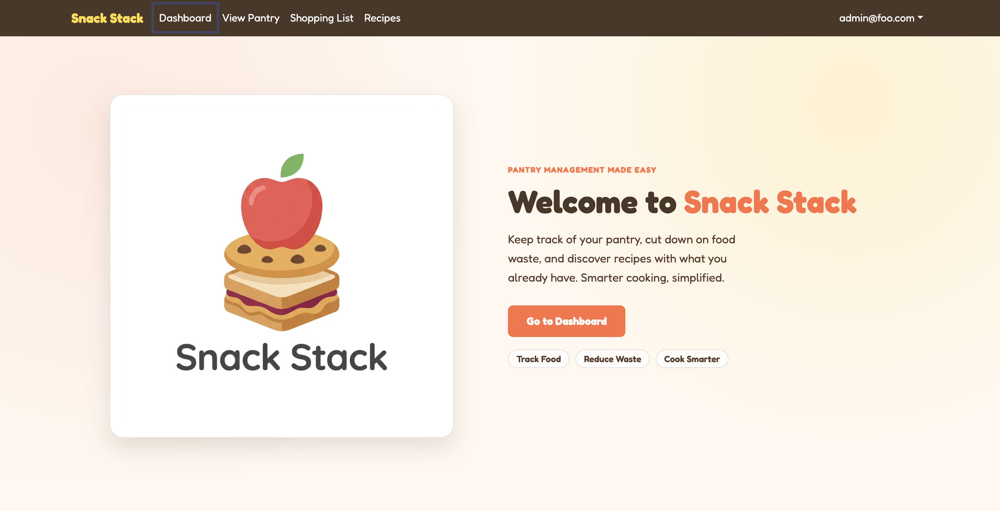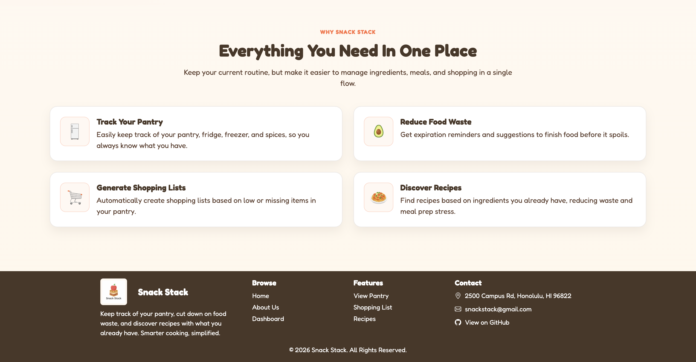

## Snack Stack

### Project Overview

This semester in ICS 414, I worked on Snack Stack, a full-stack web application designed to help users manage food-related tasks in one place. Snack Stack was forked from Pantry Pals, and my group built on the existing project by fixing bugs, further developing features, improving consistency, and polishing the user experience. The site includes a dashboard with quick alerts, pantry tracking, shopping lists, recipe features, and recommended items. Users can keep track of pantry items by category, location, storage, quantity, unit, restock threshold, and expiration date. The shopping list page helps users organize items they need, while the recipe page lets users browse, search, add recipes, and see recipes based on what is already in their pantry. Overall, Snack Stack connects pantry management, shopping, and meal planning into one system to make food organization easier and more useful.

My work on this project was mostly technical. I worked on validation, form behavior, database-related fixes, testing setup, continuous integration, search functionality, and making different parts of the site more consistent with each other. I also helped organize the project by creating the user stories, setting up most of the milestone project boards, and helping keep the group on track.

  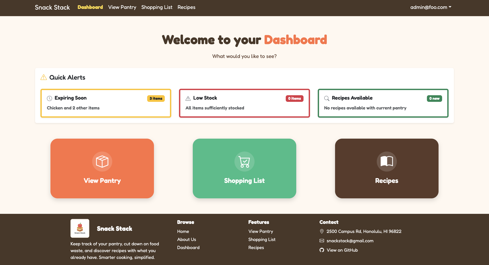 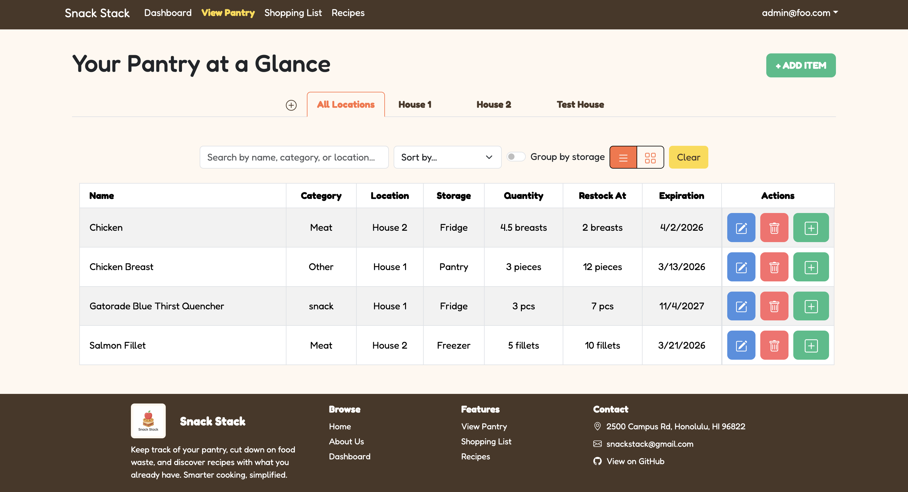 
  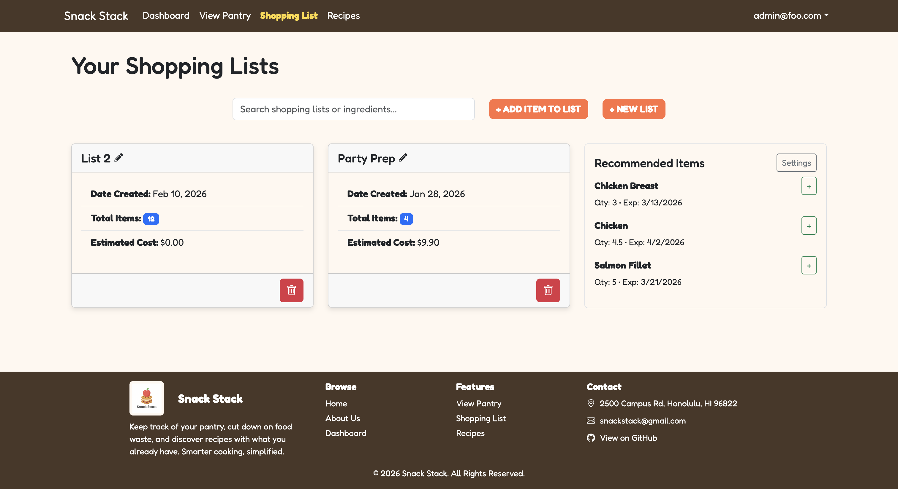 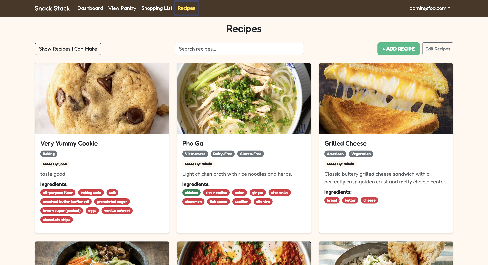

### Technical Contributions

One of my biggest technical contributions was working on the quantity, category, and unit implementation across the site. Before this, different forms handled quantity, categories, and units in different ways. The add pantry item form, edit pantry item form, add shopping list item to pantry modal, and add to shopping list modal did not all follow the same structure, which made the site feel inconsistent. I came up with the idea that item categories should be connected to designated units, so the units shown to the user would usually match the selected category instead of relying on random manual unit typing. I also kept an “Other” option for cases where the available units did not fit the item. I worked on making quantity input follow one standard structure across the add and edit forms. Other group members helped with related parts, such as the database/category setup, while I focused on making the add and edit features uniform and consistent across the site. This was one of the contributions I was most proud of because it made the application feel more organized while still giving users flexibility when needed.

  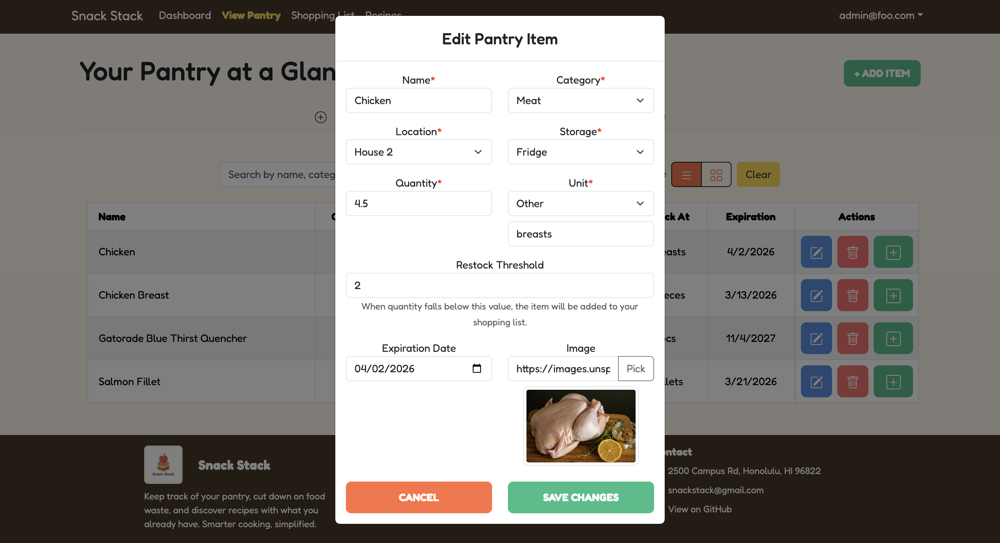 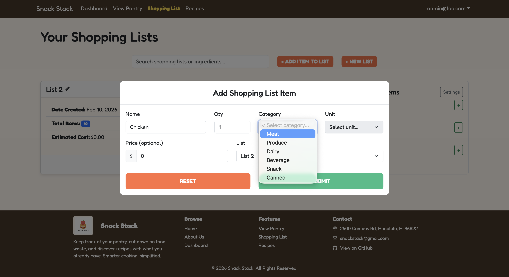

Another technical contribution I was proud of was fixing the negative value bugs for pantry items. Before this fix, users could enter negative numbers for restock thresholds and quantities when adding or editing pantry items. This was a problem because negative values do not make sense for pantry inventory and could create bad data in the database. I worked on preventing negative input in the UI and adding backend validation so invalid values would be rejected even if the frontend was bypassed. This made the application more reliable because validation was enforced on both the frontend and backend.

  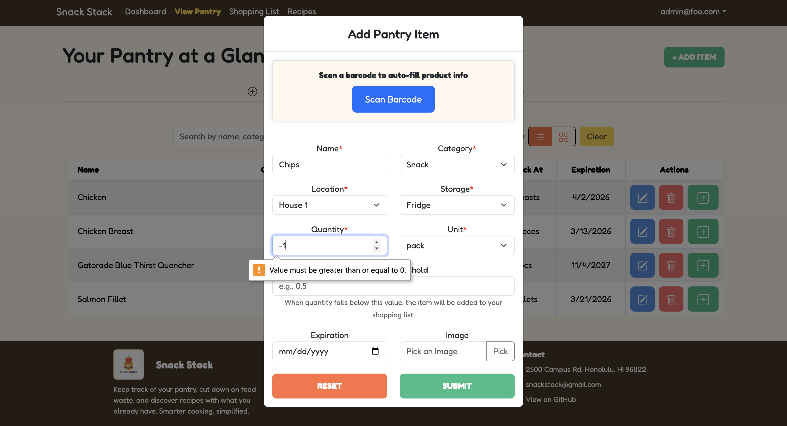

I also worked on improving form behavior in the pantry modals. When adding produce to the pantry using the form, the reset button did not fully reset all of the fields, including the units. I fixed the reset behavior and added a confirmation popup so users would not accidentally clear the form without warning. I also worked on the Edit Produce modal by adding a cancel option that would undo changes and close the modal instead of saving unwanted edits. These changes improved the usability of the forms and made the add and edit process feel more complete.

  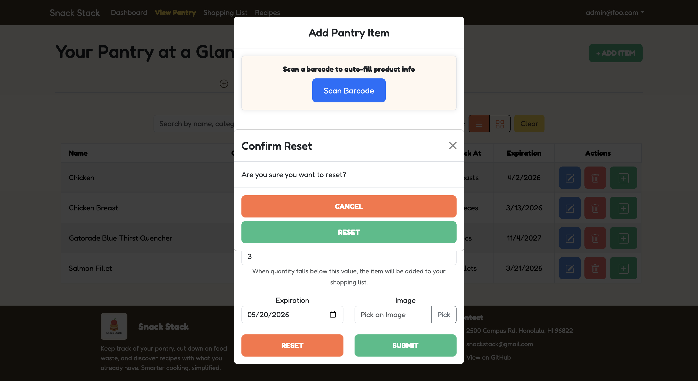

For the shopping list features, I fixed an issue where the category selection was not saving correctly when editing a shopping list item. The unit would save, but the category would not, so I worked on making sure the category was also saved properly in the database. I also added search functionality that allowed users to search shopping lists by ingredients inside the list, not just by the list name. For example, if a user searched for “chicken,” the app could filter lists that included chicken as an ingredient. I also updated the placeholder text and no-match text so the search feature matched what it actually did.

  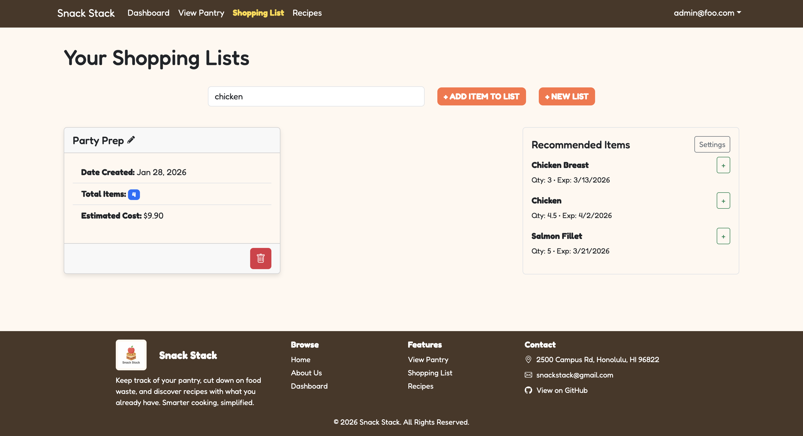

### Testing, Documentation, and Project Organization

Another important technical part of my work was setting up testing and continuous integration. I installed and set up Playwright, worked with TestCafe, edited the ci.yml file, created the workflow, and added the continuous integration badge to the repository. This made the project more professional and helped support automated testing. It also helped me understand how important testing is in a group project because one change can affect other parts of the application. I also added clearer instructions to the README, including how to get started, how to use the repository, the main features, and how to run Playwright testing.

In addition to my code contributions, I also took on a project management role within the group. I created the user stories and made most of the project boards for our milestones. Our group worked well together, and I used Discord to ask questions, clarify tasks, and help keep our progress organized. This experience showed me how important communication and planning are in software engineering, especially when different people are working on different parts of the same application.

### Reflection

At the beginning of the semester, I wanted to improve my backend and Next.js skills. Snack Stack helped me do that because I worked with validation, form handling, modals, database-connected features, testing, and search functionality. I also became more comfortable using Git and the terminal, even though I still want more practice before relying only on the command line.

Overall, ICS 414 gave me more experience with the technical side of full-stack development. I learned how frontend forms, backend validation, database updates, automated testing, and project workflows connect together in a real application. Snack Stack helped me become more confident working with Next.js and backend-related code, while also giving me experience organizing a larger project. I am proud of my work because I helped make the application more consistent, reliable, and easier to use.

### Repository Links

- [Snack Stack Repository](https://github.com/snack-stack-uhm/snack-stack)
- [Original Pantry Pals Repository](https://github.com/pantry-pals/pantry-pal)
