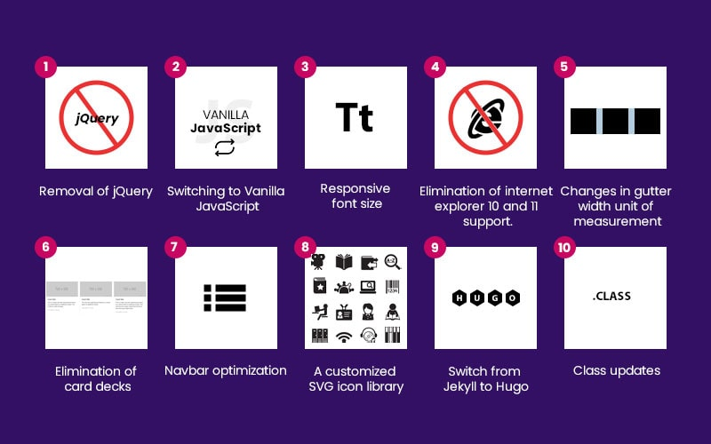

## UI Frameworks 

Bootstrap 5 is a popular UI framework that helps web developers create sophisticated, responsive, and functional websites quickly and with ease. Rather than writing all the code for layouts, buttons, and forms from scratch, Bootstrap provides ready-to-use components that can be customized to fit your needs. This UI framework saves time and effort, allowing developers to focus on the more complex aspects of website building, such as adding custom functionality. Learning to use Bootstrap took me some time to get used to, but once I got the hang of it, it became an extremely useful tool that made designing more complex websites much easier.

## Why Bootstrap 5 is a web developer's best friend 

One of the main advantages of using Bootstrap is how easy it makes it to design websites that work well on any device. With the use of its grid system and pre-styled components, it ensures that your website looks great on everything from smartphones to desktop computers. Even the navagation bar component it provides is device adaptable. Without a framework like Bootstrap, developers would need to write custom CSS for each device, which takes an immense amount of time and is error-prone. Bootstrap eliminates this problem by providing a simple way to create responsive designs that can adapt to different screen sizes.

Despite the initial learning curve, it is a powerful tool that simplifies web development. I found it extremely helpful for creating professional websites that are adaptable to different devices quickly. Bootstrap 5 is like an extra tool in your toolbox that is not necessarily needed, but it makes the process a whole lot faster and pain-free, and why not use something that makes your life easier? Work smarter, not harder.
