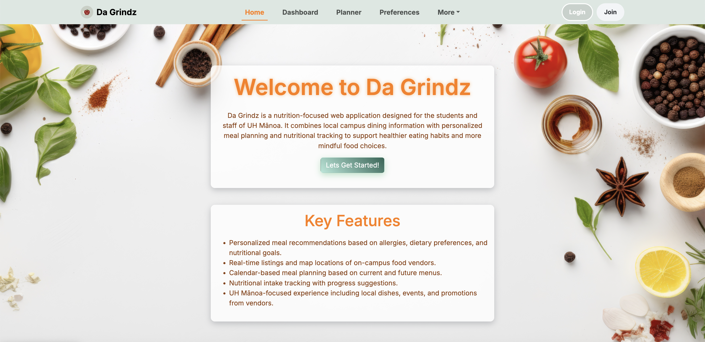
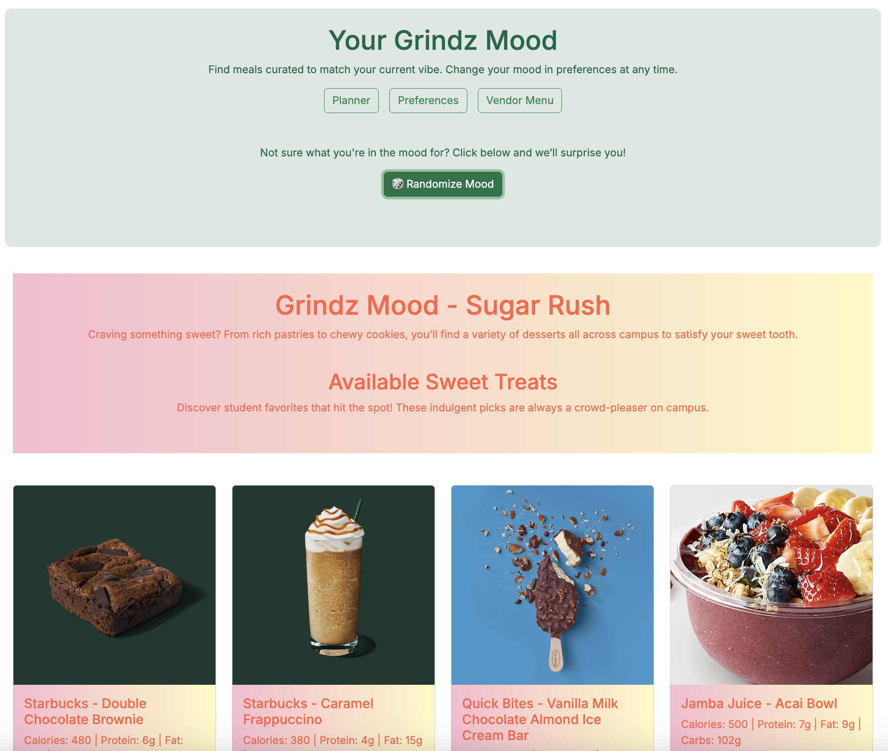
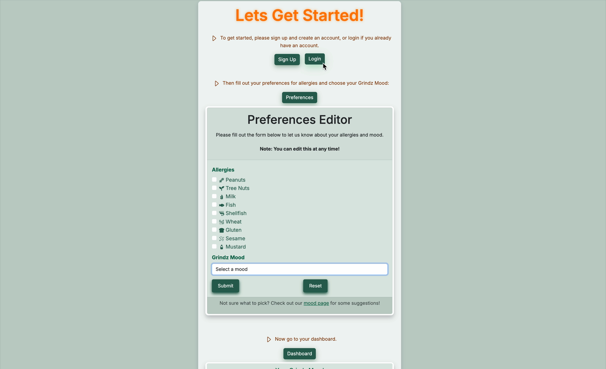
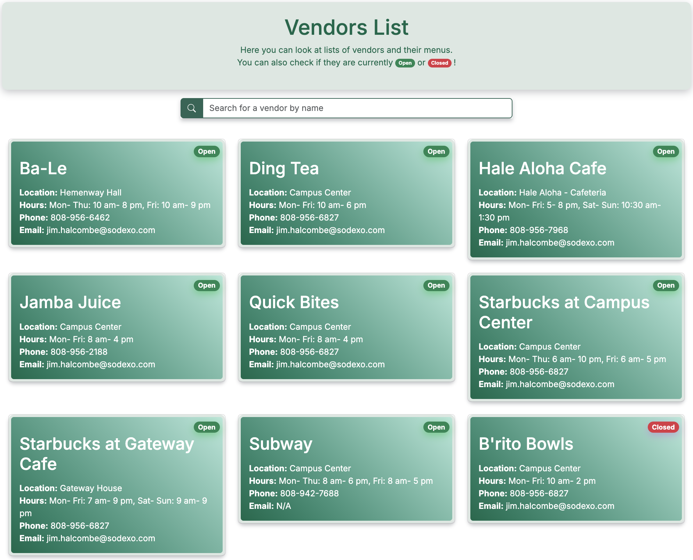

## Da Grindz
Da Grindz is a web application designed to assist the students and staff at the University of Hawai’i at Mānoa in managing their meal planning, tracking their nutritional intake, and making healthier food choices. The app provides personalized meal recommendations based on user-set dietary preferences, allergies, and specific nutritional goals like protein or calorie intake. Users can view real-time information about campus food vendors, including their operating hours and weekly menus, allowing them to plan their meals accordingly. 

The standout feature of Da Grindz is the "Grindz Mood" system, where users select their mood (e.g., "Grindz for Gains," "Vegetarian Vibes," or "Quick Bento Run") to personalize meal suggestions, UI themes, and motivational quotes. This mood-based customization appears on the dashboard page. The app also includes a drag-and-drop planner tool for meal scheduling, a shopping list generator, and interactive features like a campus map showing vendor locations. 

For my contribution to Da Grindz, I focused on front-end development, where I created an interactive navbar with animated features, making it more engaging for users. I also designed the footer and built the landing page, which includes a step-by-step "Getting Started" guide. The guide has an additional features on buttons so when hovered over they move up slightly, their shadows grow larger, and start to glow; providing a more interactive experience for users.

In addition, I developed the vendors page, which interacts with the database to display live vendor information. This page shows the current status (open or closed) of each vendor in real time and allows users to search for specific vendors. It was crucial for me to ensure smooth data integration so users could easily access the most up to date information about on-campus food options.

  
  

Throughout this project, I learned how to manage data flow from the front-end to the database and how to implement real-time features like the vendor status. I also gained experience in creating user-friendly interactive elements and optimizing the UI to enhance user experience. One of the challenges I faced was ensuring that all front-end features worked seamlessly with the back-end database, especially with dynamic features like the vendor information updates.

Working on this project also helped me improve my collaboration skills. As part of a team, I had to communicate effectively and address issues quickly to ensure we met deadlines. I learned the importance of clear communication in a team setting and how to navigate challenges to deliver a well-rounded, functional product.

## Links: 
<ul>
  <li><a href="https://da-grindz.github.io/"><i class="large github icon "></i>Project Homepage</a></li>
  <li><a href="https://github.com/da-grindz"><i class="large github icon "></i>Da Grindz GitHub</a></li>
  <li><a href="https://da-grindz.vercel.app/"><i class="large github icon "></i>Vercel Deployment</a></li>
</ul>
